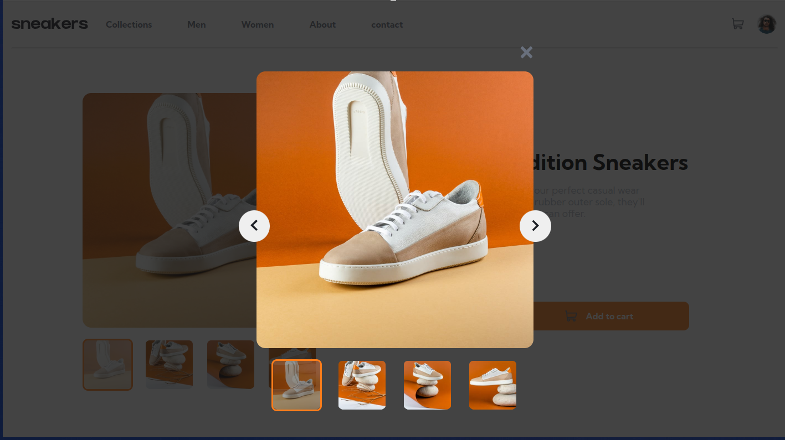

# Challenge Completion with React.js and Raw CSS

[live url](https://prabhu7x.github.io/frontend-mentor-emcommerce-challenge/)



This project showcases my successful completion of a challenge using React.js and raw CSS. In this README, I'll provide an overview of the project, its features, and how to get it up and running on your own machine.

## Table of Contents

- [Overview](#overview)
- [Features](#features)
- [Getting Started](#getting-started)

## Overview

This project demonstrates my proficiency in web development using React.js and raw CSS. I tackled a specific challenge and built a solution using these technologies.

## Features

- Response regardless of screen size

## Getting Started

To run this project on your local machine, follow these steps:

1. **Clone the Repository:**

   ```bash
   git clone https://github.com/prabhu7x/frontend-mentor-emcommerce-challenge.git
